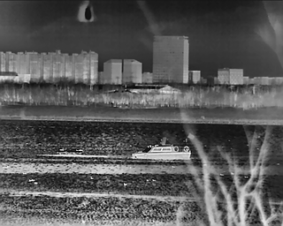
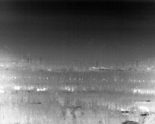
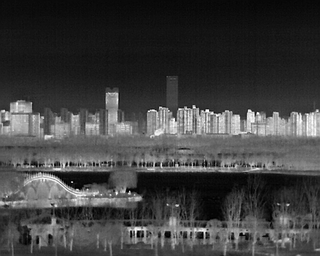
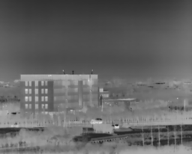

# ASMF: A Self-Supervised Atmospheric Scatter Model-Based Fusion Network for Infrared Image Enhancement

# Overview

This repository provides two key products:

1. **LGC Dataset**
2. **The Algorithm** proposed in the paper *"ASMF Self-supervised Fusion Network for Infrared Image Enhancement"*

> **Note:** The paper is currently under submission. Therefore, this repository only provides code on network to support inference. The full code will be released after the paper is published.

# LGC Dataset

## introduction 

LGC Dataset is captured by IRat Tech's LGC6122 uncooled LWIR infrared core. Its most significant advantage is its 72 mm focal length, which enables long-distance detection. For example, it facilitates the detection of human subjects at distances of up to 1.3 kilometers and vehicles at distances of 1.7 kilometers.

This dataset is made for validation and development of infrared image enhancement algorithms

<p align="center">
  
  
  
  
</p>

## Data access

1. **Baidu Cloud**

   [Access link](https://pan.baidu.com/s/1Rq2uzbcemVISyRiPYxU1zw?pwd=wy3f)  
   Password: wy3f

2. **Google Drive**

   [Access link](https://drive.google.com/drive/folders/1aOSpS7xUofiGAh2OjRe_uCcUeaTcwppb?usp=drive_link)

# ASMF: A Self-Supervised Atmospheric Scatter Model-Based Fusion Network for Infrared Image Enhancement 

## Requirements

1. Python 3.8
2. Pytorch 2.0.0
3. cuda 11.8

## Test

To run the test, use the following command:

```bash
python test.py --name="experiment_name" --Dataset="dataset_name"
```

Here is an example below:

Download folder "dataset" from:

1. **Baidu Cloud**

[Access link](https://pan.baidu.com/s/1-7OpJ9Ku8JXGb4MJziZdVQ?pwd=9auj)  
Password: 9auj

2. **Google Drive**

[Access link](https://drive.google.com/drive/folders/1YyNn-vCOCs21wkAt42uC8W52glkNmQgo?usp=sharing)

use command: 
```bash
python test.py --name=LGC_std --Dataset=LGC
```

Then you can check output images at folder "LGC_std".

## Train

Training functionality will be available after the paper is accepted.

## Use Your Own Dataset

Follow these steps to use your own dataset:

1. **Split your dataset** into training and testing data.

2. **Select several images** from the training data to serve as check data.

3. **Organize your dataset**:
   - Place the training data into `./data/train_data/datasetname`
   - Place the testing data into `./data/test_data/datasetname`
   - Place the check data into `./data/check_data/datasetname`

   Here, `"datasetname"` refers to the name of your dataset.

4. **Run the following command** to start the training/testing process:
   
```bash
python train/test.py --name="your_experiment_name" --Dataset="datasetname"
```

# At Last

Since our work is based on a self-supervised network, also known as Zero-shot or single-image enhancement in some papers, our method is recommended for training the model on your own dataset (a very small dataset, just around 200-300 images, is enough).  

If you meet any problem while using my work, you can contact my email: andy_lly@163.com. 

Unfortunately, the training code cannot be released at this time, but I will make it available as soon as possible. I sincerely hope that this repository can be helpful to you. 
